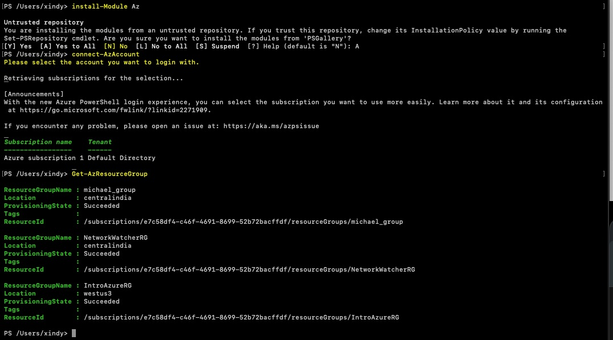
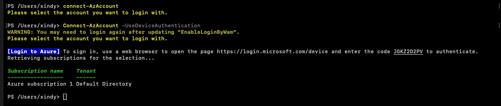
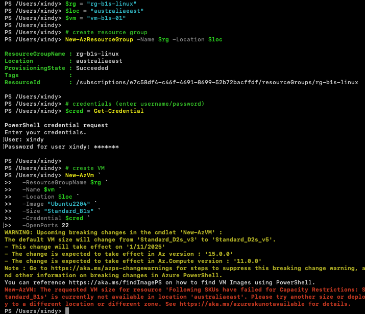
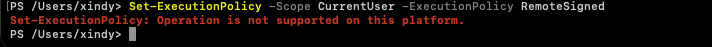
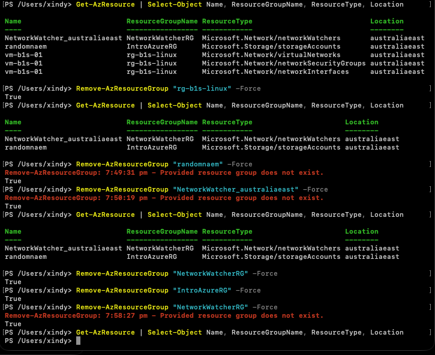
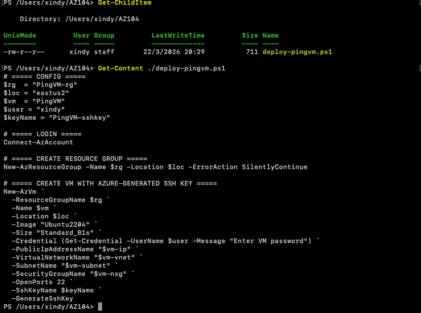

Azure Cloud Shell and Local PowerShell VM Test

Goal

Understand the basic idea of Azure Cloud Shell, then test doing similar Azure work from local PowerShell on my MacBook instead of only using the browser.

Lesson Summary

Azure Cloud Shell is a browser-based terminal for Azure.
It can run PowerShell or Bash.
It works from any device.
It does not need local setup.
The session is temporary.
Files saved in CloudDrive stay.
Use Azure from anywhere and keep important files in CloudDrive.

Lab Setup

Device: MacBook
OS: macOS
Shell: PowerShell 7
Azure tool: Az PowerShell module
Initial region tested: australiaeast

What I Did

Install-Module Az

Installed the Azure module locally, signed in, and confirmed I could query Azure resources.

Connect-AzAccount
Connect-AzAccount -UseDeviceAuthentication

Used device authentication when normal sign-in redirected me to the default browser.

Get-AzResourceGroup

Listed existing resource groups to confirm the local PowerShell session was connected to Azure correctly.

$rg = "rg-b1s-linux"
$loc = "australiaeast"
$vm = "vm-b1s-01"

New-AzResourceGroup -Name $rg -Location $loc

New-AzVm `
-ResourceGroupName $rg `
-Name $vm `
-Location $loc `
-Image "Ubuntu2204" `
-Size "Standard_B1s" `
-Credential $cred `
-OpenPorts 22

Created a test resource group and tried to deploy a small Ubuntu VM, but the selected VM size was not available in that region.

Set-ExecutionPolicy -Scope CurrentUser -ExecutionPolicy RemoteSigned

Tested execution policy and confirmed that this command is not supported on macOS PowerShell.

Retried the VM creation idea in Azure Cloud Shell and still hit Azure-side deployment issues.

Get-AzResource | Select-Object Name, ResourceGroupName, ResourceType, Location
Remove-AzResourceGroup "rg-b1s-linux" -Force

Checked what was left after the failed deployment and removed the test resource groups.

Get-Content ./deploy-pingvm.ps1

Saved the deployment steps into a reusable PowerShell script so I could test again faster later.

Issues / Errors

Standard_B1s was not available in australiaeast.
Set-ExecutionPolicy was not supported on macOS PowerShell.
Cloud Shell also ran into an SSH key name conflict.
Failed deployment attempts still created resources that needed cleanup.

Result

I installed Azure tools locally, authenticated to Azure, listed resource groups, created a test resource group, cleaned up leftover resources, and saved the deployment process into a reusable script.
The VM deployment itself did not complete because the selected VM size was not available in the region I tested.

Next Step

Check VM size availability in PowerShell before deploying again and test another region that supports the Linux VM size I want.
Finsih TMRW setup of vm from shell command and then dial in 
